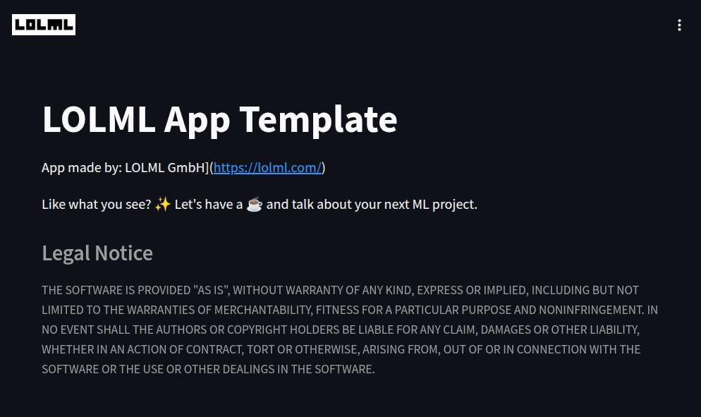

# LOLML App template

This is a simple streamlit app template repo. 

### Screenshot



# Installation


The following installation instructions use the `micromamba` package manager. 
The instructions also work verbatim with `Conda` and `Mamba`.

## Local Installation

Clone the repo: 

```
git clone [repo_url]
```

### Environment setup for Anaconda

While in the repository directory, run the following command in a terminal:

```
./make_mamba_env.sh
```

### Run the app:

- Navigate to the repository directory in your terminal.
- Activate the `lolml` environment (`conda activate lolml`).
- Run the app with streamlit: `./run_app.sh`.

The app should now be running on `http://localhost:8501` in your browser.

# Copyright and License

Copyright (c) 2024-2025 [LOLML GmbH](https://lolml.com/)

MIT License: see LICENSE file for details.

# Legal Notice

THE SOFTWARE IS PROVIDED "AS IS", WITHOUT WARRANTY OF ANY KIND, EXPRESS OR
IMPLIED, INCLUDING BUT NOT LIMITED TO THE WARRANTIES OF MERCHANTABILITY,
FITNESS FOR A PARTICULAR PURPOSE AND NONINFRINGEMENT. IN NO EVENT SHALL THE
AUTHORS OR COPYRIGHT HOLDERS BE LIABLE FOR ANY CLAIM, DAMAGES OR OTHER
LIABILITY, WHETHER IN AN ACTION OF CONTRACT, TORT OR OTHERWISE, ARISING FROM,
OUT OF OR IN CONNECTION WITH THE SOFTWARE OR THE USE OR OTHER DEALINGS IN THE
SOFTWARE.

